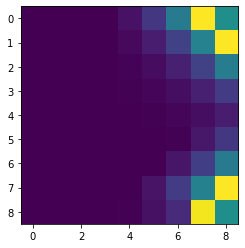

# Markov Decision Process (MDP): Solution by Exact and MaxEnt Methods

Stuart Truax, 2022-06

This repository has several implementations of solution methods for Markov decision processes
in a gridworld.

The methods include:

1. Exact methods:
  - Value iteration
  - Policy iteration
  - Linear programming
2. Value iteration with maximum entropy (MaxEnt) regularization

A Markov decision process (MDP) is defined by:

+ $S$ : a set of states
+ $A$ : a set of actions
+ $H$ : a finite time horizon $i=1, ..., H$
+ $T$ : $S \times A \times S \times \{1,...,H\} \rightarrow [0,1]$ a transition probability function $P(s_{t+1} = s' | s_t = s, a_t = a)$
+ $R$ : $S \times A \times S \times \{1,...,H\} \rightarrow \mathbb{R}$ a reward function $R(s,a,s')$

+ $\gamma$: a discount factor.

The desired result is an optimal policy $\pi^{\*}: S \times \{0,...,H\} \rightarrow A$ which describes the optimal action $a^{\*}$to be undertaken for each state $s$.

Alternatively, to find $\pi$ such that:

$$ \text{max}_{\pi} E[\sum_{t=0}^{H}\gamma^{t} R(s_{t},a_t,s_{t+1})| \pi]$$

## Results

The solution methods are performed on a "gridworld", a discretized X-Y plane where the voids and boundaries of the plane are impassable, and rewards for being a given state are indicated by the colors (rewards can be negative).

<\center>

Below is a comparison of the value and policy maps generated for the MDP gridworld
by the exact solution methods

| Solution Method | Value Function of Solution | Policy Function of Solution |
| ------------ | ---------------- |  ---------------- |
| Linear programming |    |  |
| Value iteration |    |  |
| Policy iteration |    |  |

The solution methods yield roughly the same trends in the value and policy functions.
